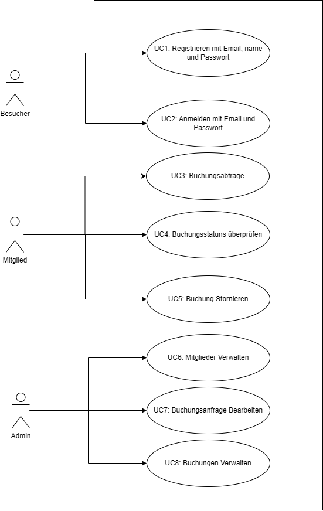

Die Usecases behandeln alle Themen, welche vom Projekt vorgegeben wurden. 
Der Admin kann alles, was ein Mitglied kann, und ein Mitglied kann alles was ein Besucher auch schon kann. => Desto höher die Rolle, desto mehr Funktionalität. 
