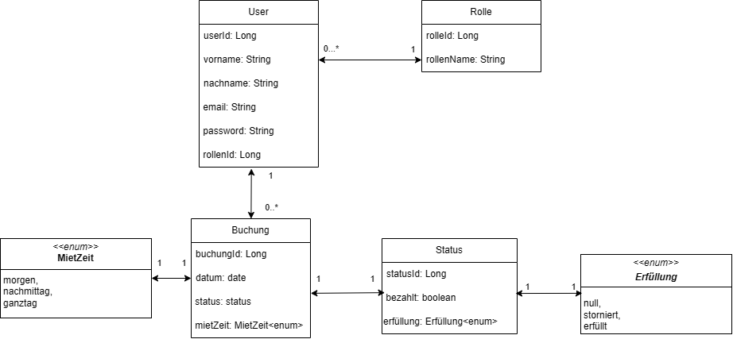

# WishManagement

Wishmanagement ist das Abschlussprojekt für das Modul M223 im ZLI. Es ist eine Room management Applikation, mit welcher Büros und Konferenzräume gemietet und gemanaget werden können.

# Aufgabe

Der zu entwickelnder Prototyp soll aus einer Server- und Client-Applikation bestehen. Die Client-Applikation benutzt die Server-Applikation über eine HTTP API. Für den Prototyp sind folgende, menschliche Akteure vorgesehen: 
-	Administrator 
-	Mitglied
-	Besucher (nicht authentifizierter Benutzer)

Folgende funktionalen Anwendungsfälle sollen mindestens im Prototypen implementiert werden:
-	Als Besucher möchte ich mich mit meinem Vor- und Nachnamen, meiner E-Mail-Adresse und einem Passwort registrieren, damit ich die Rolle Mitglied bekommen kann.
-	Als Besucher möchte ich mich mit meiner E-Mail-Adresse und meinem Passwort anmelden, damit ich mich als Mitglied oder Administrator authentifizieren kann.
-	Als Mitglied möchte ich halbe und ganze Tage an bestimmten Daten im Coworking Space als Buchung anfragen, damit ich die Angebote des Coworking Space nutzen kann.
-	Als Mitglied möchte ich den Status meiner Buchungen überprüfen, damit ich erfahre, ob meine Buchung bestätigt oder abgelehnt wurde.
-	 Als Mitglied kann ich meine zukünftigen Buchungen stornieren, damit ich auf Veränderungen in meiner Terminplanung reagieren kann.
-	Als Administrator kann ich Mitglieder verwalten (erstellen, bearbeiten, löschen), damit ich die Mitglieder organisieren kann.
-	Als Administrator kann ich Buchungsanfragen akzeptieren und ablehnen, damit die Mitglieder das Angebot des Coworking Space nutzen können. › 
-	Als Administrator kann ich Buchungen verwalten (erstellen, bearbeiten, löschen), damit ich die Buchungen organisieren kann. 
Folgende nicht-funktionale Anforderungen sollen mindestens im Prototypen umgesetzt werden:
-	 Das Datenmodell erfüllt die erste, zweite und dritte Normalform nach der relationalen Entwurfstheorie. › Der erste Besucher bekommt nach der Registrierung die Rolle Administrator anstatt Mitglied.
-	Die Authentifizierung erfolgt mittels JSON Web Token (JWT nach RFC 7519) über den HTTP Header 'Authorization'. ›
-	 Das JWT läuft 24 Stunden nach der Ausstellung ab und verliert seine Gültigkeit.
-	Das JWT wird clientseitig während dessen Lebensdauer persistent aufbewahrt.


# Instalation

Nach dem Klonen des Projektes müssen alle dependencies Instaliert werden. 

```bash
mvn install
```

Danach kann das Projekt gestartet werden.

```bash
mvn spring-boot:run
```

# Datenbank

Die Datenbank kann mit dem Befehl `docker-compose up` gestartet werden.

```bash
docker-compose up
```

Das läuft über den Port `3306` und kann mit dem User `root` und dem Passwort `root` in phpmyadmin erreicht werden.


# Testdaten

Im `AbschlussM223Application.java` file werden testdaten erstellt, welche verwendet werden können um die App zu simulieren. Sie werden durch die `@Profile("dev")` notation nur im dev modus in das Projekt eingebaut.  

Um in den `dev` modus zu wechseln, muss in der `application.properties` file die Zeile `spring.profiles.active=dev` hinzugefügt werden.

```java
    public void createInitialData(UserRepository userRepository, BookingRepository bookingRepository, StatusRepository statusRepository, RoleRepository roleRepository) {
        // Create and save a new role
        Role role = new Role();
        role.setRoleName("Admin");
        roleRepository.save(role);

        // Create and save a new user
        User user = new User();
        user.setRole(role);
        user.setFirstname("Admin");
        user.setLastname("Admin");
        user.setEmail("admin@admin.admin");
        user.setPassword("admin");
        userRepository.save(user);

        // Create and save a new status
        Status status = new Status(true, Fulfilled.FULLFILLED);
        statusRepository.save(status);

// Create and save a new booking
        Booking booking = new Booking();
        booking.setDatum(new Date());
        booking.setStatus(status);
        booking.setRentTime(RentTime.FULL_DAY);
        booking.setUser(user);
        bookingRepository.save(booking);

    }
```

# Planung


## Zusatzfunktionen 

Hinzufügend zu den Funktionen aus der Aufgabe selbst, sind einige weitere zusatzfunktionen definiert worden.

[Zusatzfunktionen](./Anforderungen/ErweiterteAnforderungen.md)


## Personas

Um sich die Nutzer der App ein wenig besser vorzustellen können habe ich drei Personas erstellt.

[Persoans](./Anforderungen/Personas.md)

## Anwendungsdiagramm

Alle Usecases, die die Nutzer und weiter machen können sind in einen Anwendungsdiagramm dargestellt.

[Anwendungsdiagramm](./Anforderungen/Anwendungsdiagramme.md)


## PersistenzDiagram

Das Persistenzdiagram zeigt die login Funktion und wie das ganze genau funktioniert.

[PersistenzDiagram](./Anforderungen/PersistenzStellen.md)

## Klassendiagramm

Das Klassendiagramm zeigt die Beziehungen zwischen den Klassen und wie sie miteinander interagieren.




## Schnittstellen

Die Schnittstellenplanung zeigt die Endpunkte der API und wie sie verwendet werden können.

[Schnittstellenplanung](./Anforderungen/Schnitstellen.md)


